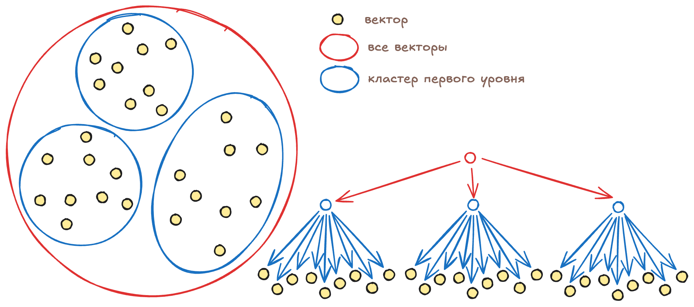
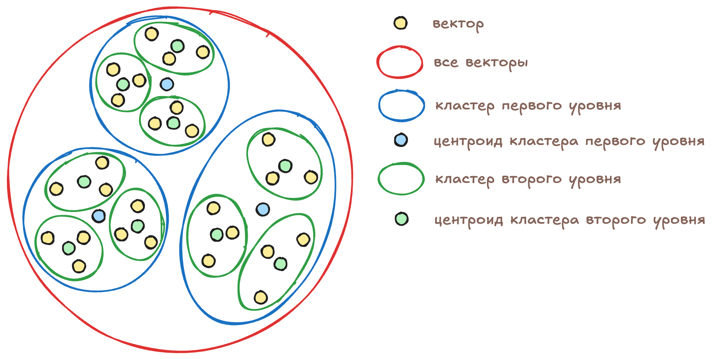
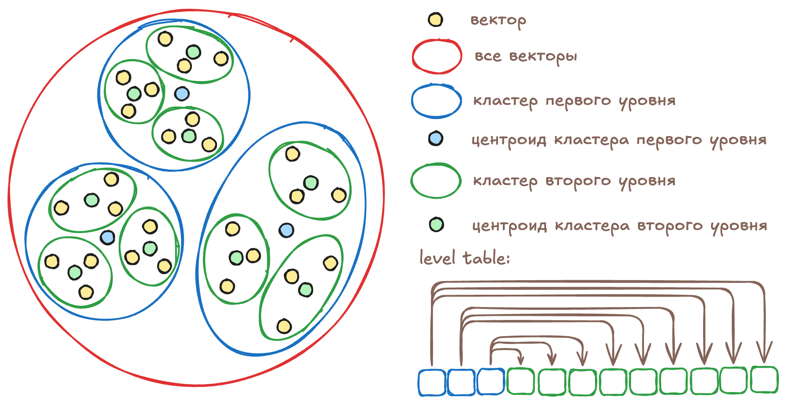

# Векторный индекс вида vector_kmeans_tree

## Создание векторного индекса {#index-create}

Алгоритм `vector_kmeans_tree` рекурсивно делит все векторы, по которым нужно вести поиск, [на кластеры](https://en.wikipedia.org/wiki/K-means_clustering). Сначала все векторы разделяются на количество кластеров, указанное при создании индекса с помощью параметра `clusters`. Например, кластеры первого уровня могут выглядеть вот так:

Затем каждый кластер, в свою очередь, разделяется на столько же кластеров. Так как каждый кластер первого уровня состоит из кластеров второго уровня, образуется дерево кластеров. Количество уровней в дереве задаётся с помощью параметра `levels`. Например, кластеры второго уровня будут выглядеть вот так:

Дерево векторного индекса будет содержать три кластера первого уровня, каждый из которых будет содержать три кластера второго уровня, каждый из которых, в свою очередь, будет содержать три вектора.

## Поиск в векторном индексе {#index-search}

Для поиска в векторном индексе `vector_kmeans_tree` последовательно выбирается на каждом уровне один из нескольких кластеров, в котором содержатся векторы, похожие на образец. Чтобы можно было выбрать нужный кластер, для каждого кластера рассчитывается и сохраняется центроид — среднее арифметическое всех векторов в кластере.

Выбрав кластер на одном из уровней, {{ ydb-short-name }} спускается на уровень ниже и перебирает кластеры, входящие в выбранный на предыдущем уровне кластер. {{ ydb-short-name }} сравнивает расстояния между центроидами кластеров и образцом, выбирая тот кластер, для которого это расстояние минимально. Приближённый поиск исходит из предположения, что если центроид кластера ближе всего к образцу, то и векторы в таком кластере тоже будут ближе всего к образцу.

Каждый кластер первого уровня разделён на кластеры второго уровня, и так далее. Алгоритм последовательно «спускается» по дереву, на каждом шаге выбирая кластер меньшего размера, пока не достигнет кластера самого нижнего уровня, который содержит не список центроидов, а непосредственно список векторов. {{ ydb-short-name }} перебирает эти векторы и выбирает заданное количество ближайших к образцу.

## Параметры индекса {#index-settings}

{{ ydb-short-name }} позволяет настроить количество уровней векторного индекса с помощью параметра `levels` и количество кластеров на каждом уровне — с помощью параметра `clusters`. Эти параметры следует подбирать с учётом ожидаемого объёма хранимых векторов, а также характеристик кластера: сетевой задержки между узлами, пропускной способности сети и производительности центральных процессоров.

Кластеры, из которых состоит дерево векторного индекса, хранятся в распределённом хранилище. На каждом переходе вниз по дереву {{ ydb-short-name }} выполняет чтение из распределённого хранилища и получает по сети бинарные данные со списком векторов. Время выполнения такой операции зависит от оборудования датацентра, сетевой нагрузки и объёма данных, передаваемых между кластерами.

Выбор одного из кластеров на уровне требует перебора всех векторов-центроидов и вычисления расстояния между ними и образцом. Оценить скорость такого перебора на конкретном оборудовании можно с помощью [запроса](../yql/reference/udf/list/knn.md#exact-vector-search-k-nearest).

Если данных мало, то параметр `levels` можно установить в один уровень. А для миллиардов векторов может потребоваться увеличить значение этого параметра до трёх уровней и подобрать оптимальное для вашего оборудования значение параметра `clusters`.

Оптимальное количество кластеров во многом зависит от производительности серверов — сколько векторов они способны перебрать в секунду. Поэтому, выбрав значение `levels` на основе ожидаемого объёма данных и сетевых задержек, значение `clusters` следует подбирать с учётом результатов тестов производительности. Для большинства аппаратных конфигураций рекомендуется не превышать 512 кластеров: современные серверы способны перебрать такое количество векторов менее чем за одну миллисекунду. Также рекомендуется, чтобы в каждом листе дерева содержалось не более 512 векторов.

## Настройка полноты поиска {#search-recall}

Если центроид кластера находится ближе всего к образцу, то, как правило, векторы этого кластера также ближе к образцу, чем векторы из других кластеров. Однако при сложных топологиях данных это может не выполняться, поэтому {{ ydb-short-name }} позволяет перебирать векторы более чем в одном кластере на каждом уровне дерева.

Количество кластеров, участвующих в поиске, задаётся параметром `KMeansTreeSearchTopSize`. По умолчанию он равен 1: {{ ydb-short-name }} выбирает один ближайший кластер на первом уровне дерева, затем запрашивает по сети его дочерние кластеры второго уровня, снова выбирает один ближайший и так далее.

Если указать большее значение, например 3, то на каждом уровне система будет выбирать не один, а три ближайших кластера. Для перехода на следующий уровень потребуется получить по сети дочерние векторы всех трёх выбранных кластеров, из которых затем будут отобраны три следующих. Такой подход повышает полноту поиска, но увеличивает объём передаваемых по сети данных и количество перебираемых векторов.

## Покрывающий индекс {#covering-index}

По умолчанию последний кластер хранит не сами векторы для поиска, а только список ключей этих векторов в таблице. Такой список мы называем Posting Table, это разновидность инвертированного индекса. Хранение ссылок на векторы вместо самих векторов позволяет минимизировать размер векторного индекса.

Но такой подход также означает, что после нахождения последнего кластера {{ ydb-short-name }} нужно будет сделать `SELECT`-запрос к таблице для получения нескольких сотен элементов (сколько именно элементов нужно будет запросить, зависит от параметра `clusters`, который определяет одновременно и количество кластеров в каждом уровне дерева, и количество векторов в последнем кластере).

Запросы на получение векторов последнего кластера могут быть медленными, если указано большое значение `clusters` или индекс таблицы не включает колонку с векторами. В таких случаях можно ускорить поиск за счёт увеличения размера индекса: если [сделать индекс покрывающим](vector-indexes.md#covering), то векторы будут храниться вместе с индексом. Данные всё ещё нужно будет получить по сети из распределённого хранилища, но это будет гораздо быстрее, чем полноценный запрос к таблице.

Кроме векторов, в покрывающий индекс можно добавить любые другие колонки из индексируемой таблицы. Тогда `SELECT`-запросы к таким колонкам будут выполняться быстрее за счёт увеличения размера индекса.

Покрывающий индекс можно дополнительно ускорить, если [включить](../yql/reference/syntax/alter_table/indexes.md#alter-index) чтение из [реплик](../concepts/datamodel/table.md#read_only_replicas).

## Внутреннее устройство индекса {#index-structure}

Индекс состоит из двух дополнительных таблиц: level table (`indexImplLevelTable`) и posting table (`indexImplPostingTable`). В таблице level table хранятся центроиды для дерева кластеров. К этой таблице {{ ydb-short-name }} делает запросы, когда переходит с уровня на уровень при векторном поиске. Например, если векторный индекс построен для 27 векторов, параметр `levels` установлен в значение 2, а параметр `clusters` в значение 3, то level table будет выглядеть вот так:

Для каждого центроида в level table также хранится информация о том, какому кластеру уровнем выше принадлежит центроид. {{ ydb-short-name }} использует эту информацию, чтобы при переходе на уровень ниже получать только те центроиды, которые принадлежат выбранным на предыдущем уровне кластерам.

Вторая таблица, posting table, используется для связи центроидов последнего уровня в level table и векторов в таблице, для которой построен индекс. Если использован покрывающий индекс, то в эту же таблицу сохраняются векторы и любые дополнительные колонки, которые указал разработчик при создании индекса:

### Структура таблицы `indexImplLevelTable`

| Колонка | Тип данных | Описание |
| --- | --- | --- |
| `__ydb_parent` | `Uint64` | Идентификатор родительского кластера |
| `__ydb_id` | `Uint64` | Идентификатор этого кластера |
| `__ydb_centroid` | `String` | Вектор центроида этого кластера |

### Структура таблицы `indexImplPostingTable`

| Колонка | Тип данных | Описание |
| --- | --- | --- |
| `__ydb_parent` | `Uint64` | Идентификатор кластера |
| `id` | `Uint64` | Первичный ключ таблицы, соответствующий одному из векторов кластера |

### Структура таблицы `indexImplPostingTable` с покрывающим индексом

| Колонка | Тип данных | Описание |
| --- | --- | --- |
| `__ydb_parent` | `Uint64` | Идентификатор кластера |
| `id` | `Uint64` | Первичный ключ таблицы, соответствующий одному из векторов кластера |
| `embedding` | `String` | Копия вектора из таблицы |
